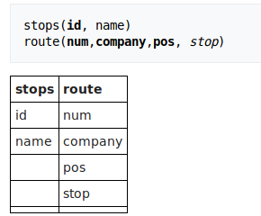

1. How many stops are in the database.

```sql
SELECT COUNT(*)
FROM stops
```

2. Find the id value for the stop 'Craiglockhart'

```sql
SELECT id
FROM stops
WHERE name='Craiglockhart'
```

3. Give the id and the name for the stops on the '4' 'LRT' service.

```sql
SELECT id, name FROM stops, route
  WHERE id=stop
    AND company='LRT'
    AND num='4'
```

4. The query shown gives the number of routes that visit either London Road (149) or Craiglockhart (53). Run the query and notice the two services that link these stops have a count of 2. Add a HAVING clause to restrict the output to these two routes.

```sql
SELECT company, num, COUNT(*)
FROM route WHERE stop=149 OR stop=53
GROUP BY company, num
HAVING COUNT(*)=2
```

5. Execute the self join shown and observe that b.stop gives all the places you can get to from Craiglockhart, without changing routes. Change the query so that it shows the services from Craiglockhart to London Road.

```sql
SELECT a.company, a.num, a.stop, b.stop
FROM route a JOIN route b ON
  (a.company=b.company AND a.num=b.num)
WHERE a.stop = 53 AND b.stop=149
```

6. The query shown is similar to the previous one, however by joining two copies of the stops table we can refer to stops by name rather than by number. Change the query so that the services between 'Craiglockhart' and 'London Road' are shown. If you are tired of these places try 'Fairmilehead' against 'Tollcross'

```sql
SELECT a.company, a.num, stopa.name, stopb.name
FROM route a JOIN route b ON
  (a.company=b.company AND a.num=b.num)
  JOIN stops stopa ON (a.stop=stopa.id)
  JOIN stops stopb ON (b.stop=stopb.id)
WHERE stopa.name='Craiglockhart'
  AND stopb.name='London Road'
```

7. Give a list of all the services which connect stops 115 and 137 ('Haymarket' and 'Leith')

```sql
SELECT DISTINCT R1.company, R1.num
  FROM route R1, route R2
  WHERE R1.num=R2.num AND R1.company=R2.company
    AND R1.stop=115 AND R2.stop=137
```

8. Give a list of the services which connect the stops 'Craiglockhart' and 'Tollcross'

```sql
SELECT R1.company, R1.num
  FROM route R1, route R2, stops S1, stops S2
  WHERE R1.num=R2.num AND R1.company=R2.company
    AND R1.stop=S1.id AND R2.stop=S2.id
    AND S1.name='Craiglockhart'
    AND S2.name='Tollcross'
```

9. Give a distinct list of the stops which may be reached from 'Craiglockhart' by taking one bus, including 'Craiglockhart' itself, offered by the LRT company. Include the company and bus no. of the relevant services.

```sql
SELECT DISTINCT S2.name, R2.company, R2.num
FROM stops S1, stops S2, route R1, route R2
WHERE S1.name='Craiglockhart'
  AND S1.id=R1.stop
  AND R1.company=R2.company AND R1.num=R2.num
  AND R2.stop=S2.id
```

10. Find the routes involving two buses that can go from Craiglockhart to Sighthill.
    Show the bus no. and company for the first bus, the name of the stop for the transfer,
    and the bus no. and company for the second bus.

```sql
SELECT DISTINCT S.num, S.company, stops.name, E.num, E.company
FROM
(SELECT a.company, a.num, b.stop
 FROM route a JOIN route b ON (a.company=b.company AND a.num=b.num)
 WHERE a.stop=(SELECT id FROM stops WHERE name= 'Craiglockhart')
)S
  JOIN
(SELECT a.company, a.num, b.stop
 FROM route a JOIN route b ON (a.company=b.company AND a.num=b.num)
 WHERE a.stop=(SELECT id FROM stops WHERE name= 'Sighthill')
)E
ON (S.stop = E.stop)
JOIN stops ON(stops.id = S.stop)
```
